# Food Plan - Architecture

> **Purpose**: The Map — system structure, boundaries, and relationships.
>
> Related docs:
> - [operations.md](./operations.md) — APIs, env vars, security, costs
> - [adr/](./adr/README.md) — Decision records with full context

This document uses the [C4 model](https://c4model.com/):
- **Level 1: System Context** — How Food Plan fits into the world
- **Level 2: Container** — The technical building blocks

---

## Level 1: System Context

```mermaid
flowchart TB
    subgraph boundary [System Context]
        user[("👤 User<br/><i>Budget-conscious family<br/>planning weekly meals</i>")]

        system["🍽️ Food Plan<br/><i>Web Application</i><br/><br/>Generates weekly meal plans,<br/>recipes, and shopping lists<br/>based on user preferences"]
    end

    user -->|"Views meal plans,<br/>manages shopping list"| system

    style user fill:#08427b,color:#fff
    style system fill:#1168bd,color:#fff
```

| Element | Type | Description |
|---------|------|-------------|
| **User** | Person | Budget-conscious family member planning meals |
| **Food Plan** | System | The web application we're building |

---

## Level 2: Container Diagram

### Prototype

```mermaid
flowchart TB
    subgraph browser ["User's Browser"]
        spa["⚛️ Next.js App<br/><i>React + TypeScript</i><br/><br/>Single-page application<br/>with client-side routing"]

        storage[("💾 localStorage<br/><i>Browser Storage</i><br/><br/>Persists meal plans,<br/>preferences, shopping list")]

        recipes["📄 Static Recipes<br/><i>JSON Data</i><br/><br/>~25 pre-defined recipes<br/>bundled with app"]
    end

    user[("👤 User")]

    user -->|"Interacts via browser"| spa
    spa -->|"Reads/writes"| storage
    spa -->|"Loads"| recipes

    style user fill:#08427b,color:#fff
    style spa fill:#1168bd,color:#fff
    style storage fill:#438dd5,color:#fff
    style recipes fill:#438dd5,color:#fff
```

| Container | Technology | Purpose |
|-----------|------------|---------|
| **Next.js App** | React, TypeScript, Tailwind | UI, routing, state management |
| **localStorage** | Browser API | Persist data between sessions |
| **Static Recipes** | JSON | Pre-defined recipe data |

### Production (Current)

The app is deployed to Vercel and uses the same architecture as the prototype - localStorage for persistence and bundled static recipes plus user-imported recipes.

```mermaid
flowchart TB
    subgraph vercel ["Vercel"]
        nextjs["⚛️ Next.js App<br/><i>Static + Serverless</i><br/><br/>React frontend with<br/>API routes for recipe parsing"]
    end

    user[("👤 User")]

    user -->|"HTTPS"| nextjs

    style user fill:#08427b,color:#fff
    style nextjs fill:#1168bd,color:#fff
```

| Container | Technology | Purpose |
|-----------|------------|---------|
| **Next.js App** | React, Vercel | UI, routing, recipe URL parsing API |
| **localStorage** | Browser API | Persist user data (plans, recipes, preferences) |

---

## Data Flow

### Meal Plan Generation

### Recipe Import from URL

---

## Key Architectural Decisions

See [ADRs](./adr/README.md) for detailed decision records. Summary:

| ADR | Decision |
|-----|----------|
| [001](./adr/001-prototype-first-approach.md) | Prototype-first development |
| [002](./adr/002-nextjs-single-deployable.md) | Next.js as single deployable |
| [003](./adr/003-localstorage-for-prototype.md) | localStorage for storage |
| [006](./adr/006-vercel-serverless-hosting.md) | Vercel serverless hosting |
