# Food Plan - Architecture

> **Purpose**: The Map — system structure, boundaries, and relationships.
>
> Related docs:
> - [operations.md](./operations.md) — APIs, env vars, security, costs
> - [adr/](./adr/README.md) — Decision records with full context

This document uses the [C4 model](https://c4model.com/):
- **Level 1: System Context** — How Food Plan fits into the world
- **Level 2: Container** — The technical building blocks

---

## Level 1: System Context

| Element | Type | Description |
|---------|------|-------------|
| **User** | Person | Budget-conscious family member planning meals |
| **Food Plan** | System | The web application we're building |
| **OpenAI API** | External | Third-party AI service (production only) |

---

## Level 2: Container Diagram

### Prototype

```mermaid
flowchart TB
    subgraph browser ["User's Browser"]
        spa["⚛️ Next.js App<br/><i>React + TypeScript</i><br/><br/>Single-page application<br/>with client-side routing"]

        storage[("💾 localStorage<br/><i>Browser Storage</i><br/><br/>Persists meal plans,<br/>preferences, shopping list")]

        recipes["📄 Static Recipes<br/><i>JSON Data</i><br/><br/>~25 pre-defined recipes<br/>bundled with app"]
    end

    user[("👤 User")]

    user -->|"Interacts via browser"| spa
    spa -->|"Reads/writes"| storage
    spa -->|"Loads"| recipes

    style user fill:#08427b,color:#fff
    style spa fill:#1168bd,color:#fff
    style storage fill:#438dd5,color:#fff
    style recipes fill:#438dd5,color:#fff
```

| Container | Technology | Purpose |
|-----------|------------|---------|
| **Next.js App** | React, TypeScript, Tailwind | UI, routing, state management |
| **localStorage** | Browser API | Persist data between sessions |
| **Static Recipes** | JSON | Pre-defined recipe data |

### Production

```mermaid
flowchart TB
    subgraph client ["Client"]
        browser["🌐 Web Browser<br/><i>React App</i><br/><br/>Next.js frontend<br/>served via Vercel"]
    end

    subgraph vercel ["Vercel (Serverless)"]
        nextjs["⚛️ Next.js Server<br/><i>Node.js Runtime</i><br/><br/>Server components,<br/>API route handlers"]
    end

    subgraph external ["External Services"]
        db[("🐘 PostgreSQL<br/><i>Neon/Supabase</i><br/><br/>User accounts, recipes,<br/>meal plans, preferences")]

        openai[("🤖 OpenAI API<br/><i>GPT-4o-mini</i><br/><br/>Recipe generation,<br/>meal planning AI")]
    end

    user[("👤 User")]

    user -->|"HTTPS"| browser
    browser <-->|"HTTPS"| nextjs
    nextjs <-->|"SQL/TLS"| db
    nextjs -->|"HTTPS"| openai

    style user fill:#08427b,color:#fff
    style browser fill:#1168bd,color:#fff
    style nextjs fill:#1168bd,color:#fff
    style db fill:#999,color:#fff
    style openai fill:#999,color:#fff
```

| Container | Technology | Purpose |
|-----------|------------|---------|
| **Web Browser** | React | Client-side rendering |
| **Next.js Server** | Node.js, Vercel | SSR, API routes, business logic |
| **PostgreSQL** | Neon/Supabase | Persistent data storage |
| **OpenAI API** | GPT-4o-mini | AI recipe/plan generation |

---

## Data Flow

### Prototype: Meal Plan Generation

### Production: Meal Plan Generation

---

## Key Architectural Decisions

See [ADRs](./adr/README.md) for detailed decision records. Summary:

| ADR | Decision |
|-----|----------|
| [001](./adr/001-prototype-first-approach.md) | Prototype-first development |
| [002](./adr/002-nextjs-single-deployable.md) | Next.js as single deployable |
| [003](./adr/003-localstorage-for-prototype.md) | localStorage for prototype |
| [004](./adr/004-postgresql-for-production.md) | PostgreSQL for production |
| [005](./adr/005-gpt4o-mini-for-ai.md) | GPT-4o-mini for AI |
| [006](./adr/006-vercel-serverless-hosting.md) | Vercel serverless hosting |
