# Food Plan - Architecture

> **Purpose**: The Map — system structure, boundaries, and relationships.
>
> For operational details (APIs, env vars, security, costs), see [operations.md](./operations.md).

This document uses the [C4 model](https://c4model.com/):
- **Level 1: System Context** — How Food Plan fits into the world
- **Level 2: Container** — The technical building blocks

---

## Level 1: System Context

| Element | Type | Description |
|---------|------|-------------|
| **User** | Person | Budget-conscious family member planning meals |
| **Food Plan** | System | The web application we're building |
| **OpenAI API** | External | Third-party AI service (production only) |

---

## Level 2: Container Diagram

### Prototype

```mermaid
flowchart TB
    subgraph browser ["User's Browser"]
        spa["⚛️ Next.js App<br/><i>React + TypeScript</i><br/><br/>Single-page application<br/>with client-side routing"]

        storage[("💾 localStorage<br/><i>Browser Storage</i><br/><br/>Persists meal plans,<br/>preferences, shopping list")]

        recipes["📄 Static Recipes<br/><i>JSON Data</i><br/><br/>~25 pre-defined recipes<br/>bundled with app"]
    end

    user[("👤 User")]

    user -->|"Interacts via browser"| spa
    spa -->|"Reads/writes"| storage
    spa -->|"Loads"| recipes

    style user fill:#08427b,color:#fff
    style spa fill:#1168bd,color:#fff
    style storage fill:#438dd5,color:#fff
    style recipes fill:#438dd5,color:#fff
```

| Container | Technology | Purpose |
|-----------|------------|---------|
| **Next.js App** | React, TypeScript, Tailwind | UI, routing, state management |
| **localStorage** | Browser API | Persist data between sessions |
| **Static Recipes** | JSON | Pre-defined recipe data |

### Production

| Container | Technology | Purpose |
|-----------|------------|---------|
| **Web Browser** | React | Client-side rendering |
| **Next.js Server** | Node.js, Vercel | SSR, API routes, business logic |
| **PostgreSQL** | Neon/Supabase | Persistent data storage |
| **OpenAI API** | GPT-4o-mini | AI recipe/plan generation |

---

## Data Flow

### Prototype: Meal Plan Generation

### Production: Meal Plan Generation

---

## Key Architectural Decisions

| Decision | Rationale |
|----------|-----------|
| **Single deployable (Next.js)** | Frontend + API in one package, simpler than separate services |
| **localStorage for prototype** | Zero infrastructure, fast iteration |
| **Serverless for production** | No server management, scales to zero |
| **PostgreSQL over NoSQL** | Relational data model (users → plans → meals) |
| **GPT-4o-mini over GPT-4** | Sufficient quality at 90% lower cost |
